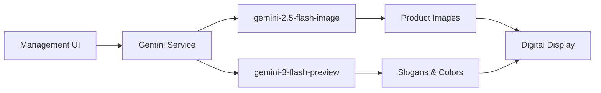

## AI-Powered Content Creation

PromoMaster Pro integrates cutting-edge Google Gemini AI models to streamline content creation for your digital signage. The AI capabilities eliminate manual design work, allowing you to generate professional marketing materials in seconds.

<CardGroup cols={2}>
  <Card title="Image Generation" icon="image" href="/ai/image-generation">
    Create professional product photography automatically using AI
  </Card>
  <Card title="Slogan Generation" icon="wand-magic-sparkles" href="/ai/slogan-generation">
    Generate impactful marketing slogans tailored to your products
  </Card>
  <Card title="Color Suggestions" icon="palette">
    Get AI-recommended color schemes based on product aesthetics
  </Card>
  <Card title="Setup Guide" icon="gear" href="/ai/setup">
    Configure your Google Gemini API key and get started
  </Card>
</CardGroup>

## Gemini Models Used

PromoMaster Pro utilizes the latest Google Gemini models for optimal performance:

<AccordionGroup>
  <Accordion title="gemini-2.5-flash-image" icon="image">
    Used for professional product image generation. This model creates high-quality, studio-style product photography with:
    - Clean backgrounds
    - Cinematic lighting
    - 4K resolution output
    - 1:1 aspect ratio (square format)
    - Hyper-realistic rendering
  </Accordion>

  <Accordion title="gemini-3-flash-preview" icon="bolt">
    Powers both slogan generation and color suggestion features:
    - **Slogan Generation**: Creates short, impactful marketing phrases (max 5 words)
    - **Color Recommendations**: Analyzes products and suggests vibrant HEX color codes
    - Fast response times for real-time content creation
  </Accordion>
</AccordionGroup>

## Key Benefits

<CardGroup cols={3}>
  <Card title="Speed" icon="rocket">
    Generate professional content in seconds instead of hours
  </Card>
  <Card title="Consistency" icon="check-double">
    Maintain brand quality across all your digital signage
  </Card>
  <Card title="Cost-Effective" icon="dollar-sign">
    Leverage free Gemini API credits for rapid prototyping
  </Card>
</CardGroup>

## Use Cases

### Rapid Prototyping
Quickly create product displays for testing and validation before investing in professional photography.

### Seasonal Campaigns
Generate fresh marketing content for holidays, sales events, and seasonal promotions without delay.

### Product Launches
Create compelling visuals and messaging for new products as soon as they're added to your catalog.

### Multi-Location Consistency
Ensure uniform branding and messaging across all your store locations with AI-generated content.

## Integration Architecture

The AI features are seamlessly integrated into the management interface:

<Note>
  All AI features include fallback mechanisms to ensure your signage continues working even if the API is unavailable.
</Note>

## Getting Started

Ready to leverage AI in your digital signage? Follow these steps:

<Steps>
  <Step title="Get API Access">
    Obtain a Google Gemini API key from the [Google AI Studio](https://ai.google.dev/)
  </Step>
  <Step title="Configure API Key">
    Set up your API key in the application environment - see [Setup Guide](/ai/setup)
  </Step>
  <Step title="Start Creating">
    Use the AI features from the product management interface to generate content
  </Step>
</Steps>

<Check>
  New users receive free credits from Google Gemini to get started with AI-powered content generation!
</Check>