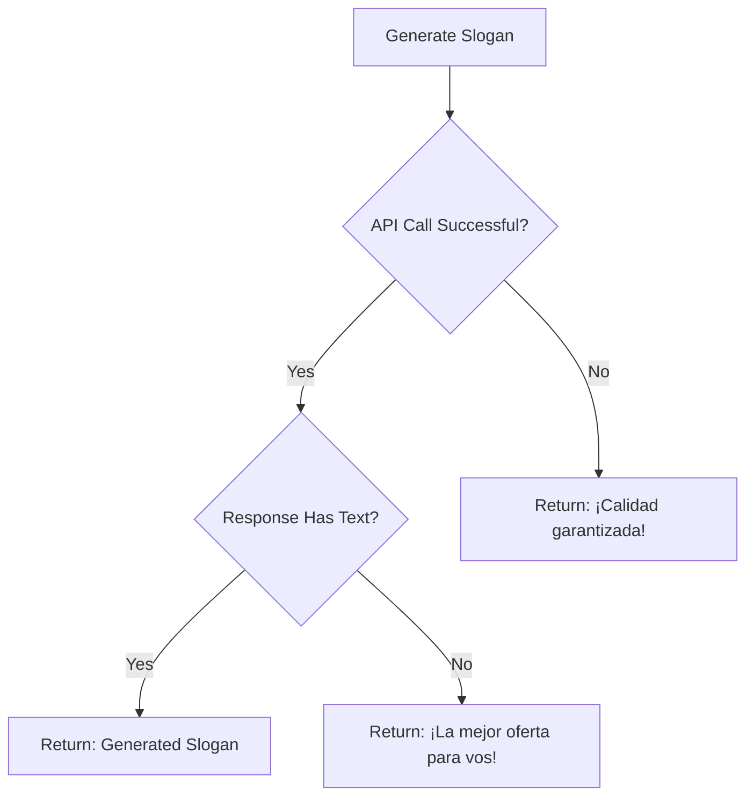

## Overview

The AI Slogan Generation feature leverages Google's **gemini-3-flash-preview** model to create short, impactful marketing phrases tailored to your products. These slogans are designed to be attention-grabbing and sales-focused for digital signage.

<Info>
  Slogans are generated in Spanish and limited to 5 words for maximum impact on digital displays.
</Info>

## Function Signature

```typescript services/geminiService.ts
export const generateSlogan = async (
  productName: string,
  description: string
): Promise<string>
```

### Parameters

<ParamField path="productName" type="string" required>
  The name of the product (e.g., "Samsung Galaxy S24", "Chocolate Premium")
</ParamField>

<ParamField path="description" type="string" required>
  A brief description of the product's key features or benefits (e.g., "High-end smartphone with advanced camera", "Belgian dark chocolate 80% cocoa")
</ParamField>

### Returns

<ResponseField name="return" type="string">
  Always returns a string containing:
  - **Success**: AI-generated slogan (max 5 words)
  - **API Error**: `"¡Calidad garantizada!"` (fallback slogan)
  - **Empty Response**: `"¡La mejor oferta para vos!"` (default slogan)
</ResponseField>

<Check>
  This function **always returns a valid slogan**, ensuring your digital signage never displays empty content.
</Check>

## How It Works

### 1. Prompt Engineering

The function uses a carefully crafted Spanish prompt:

```typescript
const response = await ai.models.generateContent({
  model: 'gemini-3-flash-preview',
  contents: `Genera un eslogan de marketing corto (máximo 5 palabras), impactante y llamativo para un producto llamado "${productName}" que se describe como: "${description}". Responde solo con el texto del eslogan.`,
});
```

<Tip>
  The prompt explicitly requests:
  - **Short length**: Maximum 5 words
  - **Impact**: Attention-grabbing and compelling
  - **Marketing focus**: Sales-oriented language
  - **Clean output**: Only the slogan text, no additional commentary
</Tip>

### 2. Response Processing

The function extracts and cleans the generated text:

```typescript
return response.text?.trim() || "¡La mejor oferta para vos!";
```

### 3. Error Handling with Fallback

Robust error handling ensures continuous operation:

```typescript
try {
  // ... generation logic
} catch (error) {
  console.error("Error generating slogan:", error);
  return "¡Calidad garantizada!";
}
```

## Usage Example

### In the Management Interface

```tsx components/Management.tsx
const handleSloganGeneration = async () => {
  if (!productForm.name) {
    alert("Indica el nombre del producto.");
    return;
  }
  setIsGeneratingSlogan(true);
  const slogan = await generateSlogan(
    productForm.name, 
    productForm.description
  );
  setProductForm(prev => ({ ...prev, slogan }));
  setIsGeneratingSlogan(false);
};
```

### UI Integration

The slogan generator includes a dedicated button with loading state:

```tsx
<button 
  type="button" 
  onClick={async () => {
    if(!productForm.name) return alert("Indica el nombre del producto.");
    setIsGeneratingSlogan(true);
    const s = await generateSlogan(productForm.name, productForm.description);
    setProductForm(prev => ({ ...prev, slogan: s }));
    setIsGeneratingSlogan(false);
  }} 
  className="h-fit p-3 bg-amber-100 text-amber-600 rounded-xl hover:bg-amber-200 transition-colors"
>
  {isGeneratingSlogan ? (
    <Loader2 className="animate-spin" size={20} />
  ) : (
    <Sparkles size={20} />
  )}
</button>
```

## Example Inputs and Outputs

<CodeGroup>
```typescript Example 1: Electronics
const slogan = await generateSlogan(
  "iPhone 15 Pro Max",
  "Premium smartphone with titanium frame and advanced camera system"
);
// Possible outputs:
// "Tecnología que inspira innovación"
// "El futuro en tu mano"
// "Captura momentos únicos profesionalmente"
```

```typescript Example 2: Food Products
const slogan = await generateSlogan(
  "Pizza Napolitana Artesanal",
  "Traditional Italian pizza with fresh mozzarella and wood-fired baking"
);
// Possible outputs:
// "Sabor auténtico de Italia"
// "Tradición italiana en cada bocado"
// "¡Como en Nápoles mismo!"
```

```typescript Example 3: Fashion
const slogan = await generateSlogan(
  "Zapatillas Running ProSport",
  "Lightweight running shoes with advanced cushioning technology"
);
// Possible outputs:
// "Corre más rápido y cómodo"
// "Tu mejor performance garantizada"
// "Livianas y potentes siempre"
```
</CodeGroup>

## Fallback Behavior

The function implements a **two-tier fallback system**:



<AccordionGroup>
  <Accordion title="Primary Fallback: Empty Response" icon="1">
    If the API responds but returns no text:
    ```typescript
    return response.text?.trim() || "¡La mejor oferta para vos!";
    ```
    Returns: **"¡La mejor oferta para vos!"**
  </Accordion>

  <Accordion title="Secondary Fallback: API Error" icon="2">
    If the API call throws an error:
    ```typescript
    catch (error) {
      console.error("Error generating slogan:", error);
      return "¡Calidad garantizada!";
    }
    ```
    Returns: **"¡Calidad garantizada!"**
  </Accordion>
</AccordionGroup>

## Best Practices

### 1. Provide Context in Descriptions

<CodeGroup>
```typescript Good Practice ✅
await generateSlogan(
  "Aceite de Oliva Extra Virgen",
  "Premium cold-pressed olive oil from Andalusia with fruity notes"
);
// Better results due to detailed description
```

```typescript Poor Practice ❌
await generateSlogan(
  "Aceite de Oliva Extra Virgen",
  "Aceite"
);
// Generic results due to minimal context
```
</CodeGroup>

### 2. Handle Loading States

<Tip>
  Always show visual feedback during generation (typically 1-3 seconds):
  ```tsx
  {isGeneratingSlogan ? (
    <Loader2 className="animate-spin" />
  ) : (
    <Sparkles />
  )}
  ```
</Tip>

### 3. Allow Manual Editing

The UI allows users to edit AI-generated slogans:

```tsx
<textarea 
  className="flex-1 px-4 py-2 bg-slate-50 border border-slate-200 rounded-xl"
  value={productForm.slogan}
  onChange={e => setProductForm({...productForm, slogan: e.target.value})}
  placeholder="Mensaje corto e impactante..."
/>
```

### 4. Validate Product Name

Always check that a product name exists before generating:

```typescript
if (!productForm.name) {
  alert("Indica el nombre del producto.");
  return;
}
```

## Performance Characteristics

<CardGroup cols={3}>
  <Card title="Speed" icon="bolt">
    **1-3 seconds**
    
    Fast response with gemini-3-flash-preview
  </Card>
  <Card title="Reliability" icon="shield-check">
    **100% uptime**
    
    Fallback ensures always returns a slogan
  </Card>
  <Card title="Language" icon="language">
    **Spanish**
    
    Optimized for Latin American market
  </Card>
</CardGroup>

## Slogan Guidelines

Generated slogans follow these principles:

<AccordionGroup>
  <Accordion title="Length: 5 Words Maximum" icon="ruler">
    Short slogans are more memorable and fit better on digital signage displays.
  </Accordion>

  <Accordion title="Action-Oriented" icon="bolt">
    Uses verbs and calls-to-action to drive engagement (e.g., "Descubre", "Prueba", "Vive").
  </Accordion>

  <Accordion title="Emotionally Resonant" icon="heart">
    Creates emotional connection with words like "auténtico", "premium", "único".
  </Accordion>

  <Accordion title="Sales-Focused" icon="chart-line">
    Emphasizes value, quality, and benefits to drive purchase decisions.
  </Accordion>
</AccordionGroup>

## Troubleshooting

<AccordionGroup>
  <Accordion title="Generic slogans returned" icon="circle-question">
    **Cause:** Insufficient or vague product description
    
    **Solution:** Provide more detailed descriptions with:
    - Key features and benefits
    - Brand positioning (premium, budget, etc.)
    - Target audience considerations
    - Unique selling points
  </Accordion>

  <Accordion title="Slogans too long" icon="text">
    **Cause:** AI occasionally exceeds the 5-word limit
    
    **Solution:** 
    - Manually edit the slogan in the textarea
    - Regenerate for a different result
    - The prompt requests 5 words maximum, but AI may vary
  </Accordion>

  <Accordion title="Always getting fallback slogans" icon="exclamation-triangle">
    **Cause:** API key not configured or API errors
    
    **Solution:** 
    - Verify API key in environment configuration
    - Check browser console for error messages
    - Confirm internet connectivity
    - See [Setup Guide](/ai/setup) for configuration help
  </Accordion>
</AccordionGroup>

## Integration with Display

Generated slogans appear in the digital signage ticker:

```tsx components/AdDisplay.tsx
<div className="absolute bottom-0 left-0 right-0 bg-black/90 py-2 overflow-hidden">
  <div className="animate-marquee whitespace-nowrap">
    <span className="text-yellow-300 font-bold">
      {product.slogan || 'Calidad Premium'} • {product.name}
    </span>
  </div>
</div>
```

## Next Steps

<CardGroup cols={2}>
  <Card title="Image Generation" icon="image" href="/ai/image-generation">
    Learn about AI-powered product photography
  </Card>
  <Card title="Setup Guide" icon="gear" href="/ai/setup">
    Configure your Gemini API key
  </Card>
</CardGroup>